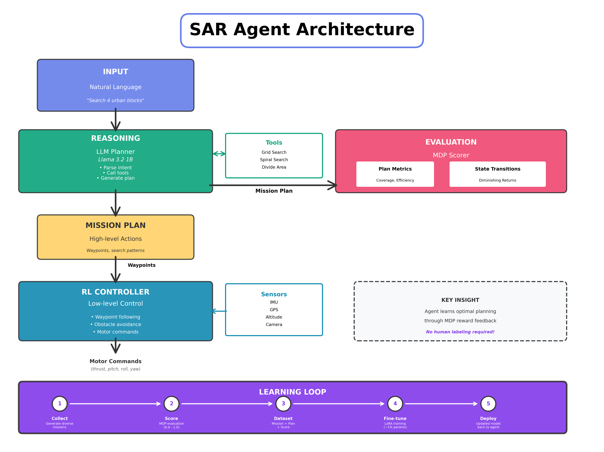

# LLM-Based Search and Rescue Drone System

CS672 Fundamentals of AI Agents - Final Project

## Overview

Autonomous search and rescue drone system using **gym-pybullet-drones** with LLM-based mission planning and reinforcement learning for drone control.

### System Architecture



The system uses a hierarchical architecture combining high-level strategic planning with low-level control:

- **LLM Planner** (Llama 3.2 1B): Interprets natural language commands and generates structured mission plans using domain-specific tools (grid search, spiral patterns, multi-agent coordination)

- **MDP Evaluator**: Scores mission plans based on coverage, efficiency, safety, and completeness. Provides feedback for training the LLM through transfer learning with LoRA fine-tuning

- **RL Controller**: Executes low-level flight control, translating high-level waypoints into motor commands while processing real-time sensor data (IMU, GPS, altitude)

- **Learning Loop**: Continuously improves the LLM planner by generating diverse missions, scoring them with the MDP evaluator, and fine-tuning the model on high-quality examples

The LLM learns optimal planning strategies through reward feedback from the MDP evaluator—no manual labeling required.

## Features

- **Natural Language Interface**: "Search 4 urban blocks for missing person"
- **Tool-Augmented LLM**: Grid search, spiral patterns, area division
- **MDP-Based Evaluation**: Diminishing returns model for sequential decision-making
- **Transfer Learning**: LoRA fine-tuning with reward-weighted loss
- **Autonomous Flight**: RL-based low-level control with sensor fusion
- **Physics Simulation**: PyBullet-based realistic flight dynamics

## Quick Start

```bash
# Setup environment
python -m venv .venv
source .venv/bin/activate  # On Windows: .venv\Scripts\activate
pip install -r requirements.txt

# Test LLM planner
python test_sar_planner.py
```

## Technologies

- **LLM**: Llama 3.2 1B Instruct (Meta)
- **Training**: LoRA (Low-Rank Adaptation), PyTorch, Transformers
- **Simulation**: PyBullet, gym-pybullet-drones
- **Vision**: Instance segmentation (planned)

## Citation

This project uses [gym-pybullet-drones](https://github.com/utiasDSL/gym-pybullet-drones). If you use this work, please cite:

```bibtex
@INPROCEEDINGS{panerati2021learning,
    title={Learning to Fly---a Gym Environment with PyBullet Physics for Reinforcement Learning of Multi-agent Quadcopter Control},
    author={Jacopo Panerati and Hehui Zheng and SiQi Zhou and James Xu and Amanda Prorok and Angela P. Schoellig},
    booktitle={2021 IEEE/RSJ International Conference on Intelligent Robots and Systems (IROS)},
    year={2021},
    pages={7512-7519},
    doi={10.1109/IROS51168.2021.9635857}
}
```

## Future Work

- [x] Plan architecture
- [ ] LLM planner and MDP evaluation
- [ ] Transfer learning pipeline
- [ ] PyBullet integration
- [ ] Vision system (person detection)
- [ ] Multi-drone coordination (fleet operations)
- [ ] Real-world hardware deployment